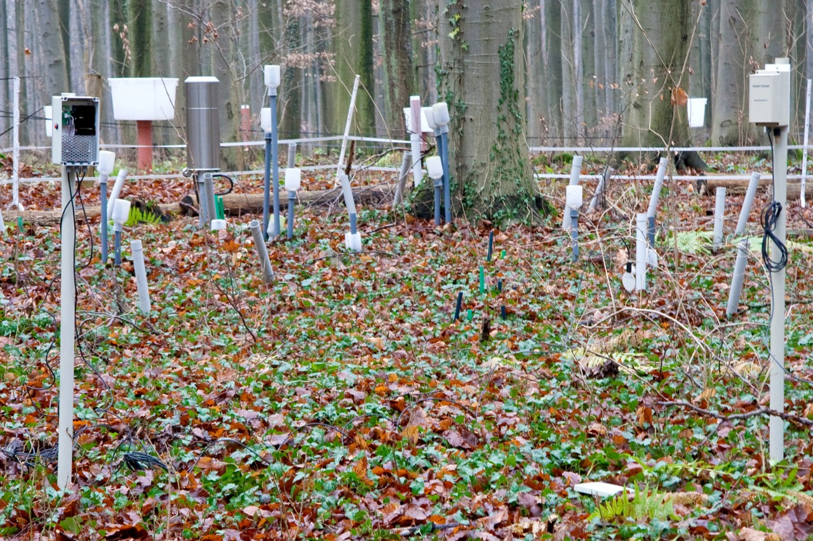
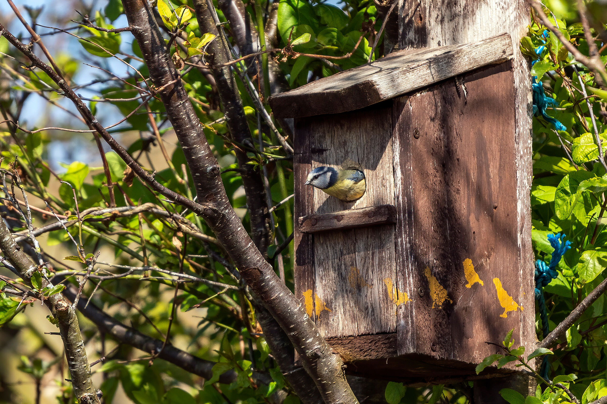
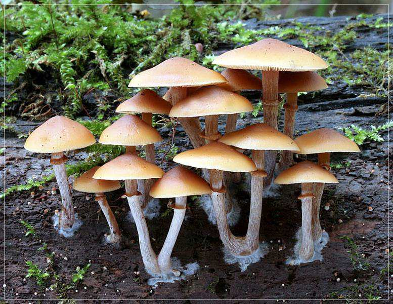

># Einleitung
>>- Logo
>>- ForestGuardian
>>- Namen der Mitglieder

>## Problem:
>>- Viele verschiedene Gefahren für den Wald
>>  - Pilze
>>  - Käfer
>>  - Klima
>>- Gegen diese Gefahren kann nur was getan werden, wenn man sie (früh genug) erkennt
>>- Lösungen: einzelne Sensoren (Alle autag) oder kleine Sensorbundle. Meist kein Hosting, nur Werte, "Voluminös"
>>  - Viele autage Sensoren = Viele Akkus, Viel Strom, Akku Management schwierig
>> 
>> 

>## Lösung:
>>- Sensorknoten = ein autages Gerät mit 1 Akku, 1 Sender, Solar, Hosting, "kompakt"
>> 
>>- Vogelhaus als Gimmik
>>- Benutzerfreundlich (auch für Nicht-Informatiker)

>## Umsetzung:
>>### Hardware:
>>>- Sensoren, welche Use-Cases abdecken:
>>>  - Trockenheit/Nässe
>>>    - Brandgefahr
>>>    - 
>>>  - Luftqualität
>>>    - Viel tote Bäume - tote Bäume können Monate lang lebendig aussehen und wenige Jahre lang stehen bleiben
>>>    
>>### Backend:
>>> - Python-Backend
>>> - Django-Server
>>> - Empfängt Daten in JSON, verarbeitet, sendet an Frontend
>>> 
>>### Frontend:
>>> Live-Demo
>>>> - Was wird gezeigt?
>>>> - Wie wird das gezeigt?

> Forecast!:
>> Live-Demo:
>>>- Weitere Werte
>>>- Historie
>>>- Jahreszeiten berücksichtigen
>>>- Animationen UX
>>>- Vogelhaus
>>>- Referenzen
>>>- Hilfe
>>>- Signalstärke
>>>
>> Hardware:
>>>- Weitere Sensoren
>>>  - Borkenkäfer
>>>  - Pilz-sporen
>>>  - Punktdendrometer(Umfang)
>>>  - Baumfluss